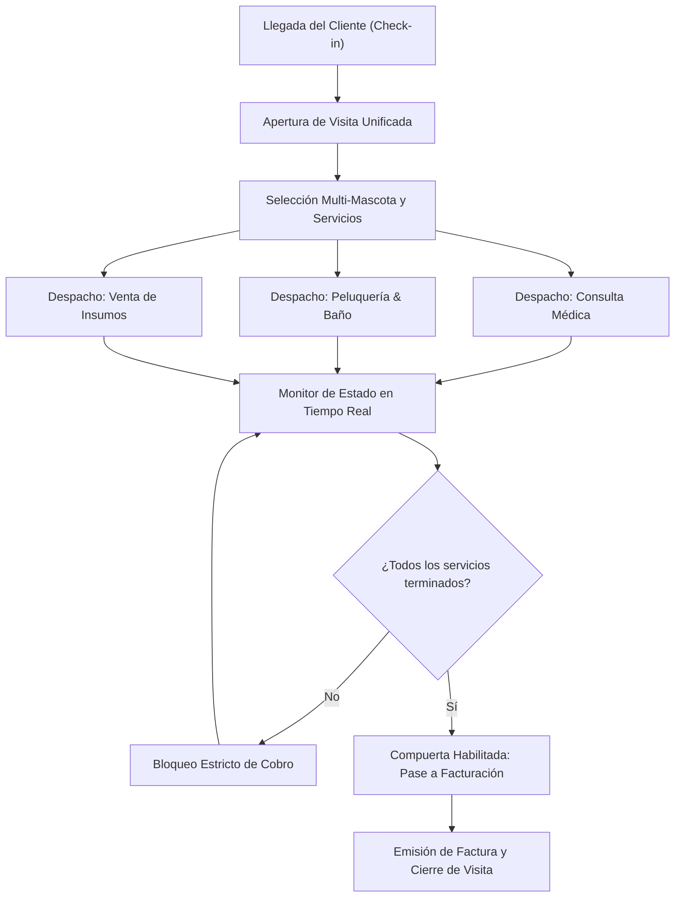

# Mapa de Arquitectura, Estructura y Reglas de Negocio de Betty Suite

Este documento describe la estructura arquitectónica del monorepo mediante un mapa agnóstico basado en patrones de expresiones, adaptado íntegramente al dominio de **Betty Suite** (plataforma integral de gestión para clínicas veterinarias, consultorios médicos y centros de estética animal). Cada rama y quiebre del árbol detalla la finalidad arquitectónica del directorio o archivo, integrando los flujos funcionales, la matriz de roles y las reglas de negocio del sistema.

---

## Patrones y Convenciones Generales

Todas las definiciones técnicas, tokens, identificadores de rutas y convenciones de nombres se expresan en minúsculas:

- **`[project-name]`**: identificador de la plataforma en configuraciones específicas (`betty-suite`).
- **`[module]` / `[feature]` / `[resource]`**: nombre de la entidad, módulo de negocio o recurso en kebab-case y minúsculas (`patients`, `clients`, `appointments`, `visits`, `grooming`, `consultations`, `prescriptions`, `inventory`, `invoices`, `finance`, `clinics`, `portals`).
- **`[verb]`**: método HTTP en minúsculas (`get`, `post`, `put`, `delete`).
- **`[role]`**: rol o contexto de sesión de usuario en minúsculas (`superadmin`, `owner`, `employee`, `public`).
- **`[queue-name]`**: nombre de la cola SQS y su worker Lambda en minúsculas (`appointment-reminder`, `vaccine-due-reminder`, `stock-alert-notifier`, `invoice-generator`, `medical-history-export`).
- **`[entity]`**: nombre de la tabla en base de datos en singular o plural camelCase / minúsculas (`clinics`, `users`, `clients`, `patients`, `appointments`, `visits`, `visitItems`, `consultations`, `prescriptions`, `groomingOrders`, `inventoryItems`, `inventoryMovements`, `invoices`, `invoiceItems`, `auditLogs`).
- **`[Component]`**: nombre de componente React/Astro en PascalCase.

---

## Árbol de Archivos y Patrones Arquitectónicos

```text
.
├── .dockerignore                                          # Reglas de exclusión de archivos y carpetas para optimizar el contexto de construcción de imágenes Docker
├── .npmrc                                                 # Configuración de resolución, hoisting, scopes y registros para los workspaces del monorepo
├── docker-compose.yaml                                    # Definición y orquestación de contenedores locales (PostgreSQL, emuladores y servicios auxiliares)
├── package.json                                           # Manifiesto raíz del monorepo con definición de workspaces de Bun y scripts orquestadores globales
├── start-local-development.sh                             # Script Bash de automatización para arrancar el entorno completo de desarrollo local
│
├── client/                                                # SPA frontend de paneles de usuario (React + Vite + Tailwind CSS)
│   ├── index.html                                         # Documento HTML base y punto de entrada montado por Vite
│   ├── package.json                                       # Manifiesto de dependencias, librerías UI y scripts de ejecución de la SPA
│   ├── vite.config.js                                     # Configuración de empaquetado de Vite (plugins de React, puertos y resolución de alias)
│   ├── public/                                            # Archivos y activos estáticos servidos directamente sin procesamiento de empaquetador
│   │   ├── favicon.svg                                    # Ícono principal de la pestaña de la aplicación web
│   │   └── assets/                                        # Directorio de recursos estáticos globales no procesados (logotipos, iconos vectoriales)
│   └── src/                                               # Código fuente principal de la aplicación React
│       ├── main.jsx                                       # Punto de inicialización y montaje de React en el DOM (`createRoot`)
│       ├── App.jsx                                        # Componente raíz que orquesta los proveedores globales (Providers) y el enrutador
│       ├── globals.css                                    # Estilos globales y capas de utilidades de Tailwind CSS
│       ├── components/                                    # Componentes visuales reutilizables de UI transversales a toda la SPA
│       │   ├── [Component].jsx                            # Componente atómico o transversal reutilizable (PascalCase)
│       │   └── [Component-Group]/                         # Esta carpeta agrupa subcomponentes por dominio visual o funcional (ej. ui, CustomTable, form)
│       │       └── [Component].jsx                        # Componente individual perteneciente al grupo funcional
│       ├── constants/                                     # Catálogo centralizado de constantes y opciones de interfaz
│       │   └── [resource].js                              # Constantes asociadas a un recurso específico (ej. patients.js, appointments.js, inventory.js)
│       ├── core/                                          # Primitivas y wrappers estructurales de la arquitectura cliente
│       │   ├── service.js                                 # Factory cliente HTTP REST (`service()`) para comunicación estándar con el API
│       │   └── upload.js                                  # Utilidad cliente para subida directa de archivos binarios a S3 vía URLs prefirmadas
│       ├── hooks/                                         # Custom hooks reutilizables para manejo de lógica y estado
│       │   └── use-[hook-name].js                         # Custom hook transversal reutilizable (ej. use-form.js, use-resolver.js, use-mutation.js)
│       ├── lib/                                           # Librerías auxiliares y funciones utilitarias independientes de la vista
│       │   └── [utility].js                               # Funciones utilitarias transversales (fechas, logging, formateadores de moneda/peso)
│       ├── modals/                                        # Modales y diálogos interactivos de alcance global
│       │   └── [Modal-Name]/                              # Esta carpeta encapsula la lógica y presentación de un modal global específico
│       │       └── [modal-component].jsx                  # Componente visual e interactivo del modal
│       ├── routes/                                        # Definición modular de árboles de rutas protegidos y segmentados por rol
│       │   └── [role].routes.jsx                          # Definición del árbol de rutas por rol (superadmin.routes.jsx, owner.routes.jsx, employee.routes.jsx, public.routes.jsx)
│       ├── stores/                                        # Estado global de la aplicación gestionado con Zustand
│       │   └── [store-name].store.js                      # Store global atómico de cliente (ej. session.store.js para perfil y rol de usuario activo)
│       └── modules/                                       # Módulos de pantalla de la SPA organizados estrictamente por rol de usuario
│           └── [role]/                                    # Esta carpeta aísla las vistas según el rol de acceso (superadmin, owner, employee, public)
│               └── [feature]/                             # Esta carpeta define una pantalla o funcionalidad concreta dentro de ese rol
│                   ├── page.jsx                           # Componente visual principal de la pantalla
│                   ├── resolvers.js                       # Declaración obligatoria de resolvers de carga de datos para el hook `useResolver`
│                   ├── [feature].service.js               # Cliente de servicio HTTP específico de la pantalla instanciado con `service()`
│                   ├── [feature].schema.js                # Esquemas Zod para validación de formularios y datos de entrada de la pantalla
│                   ├── use-[feature-hook].js              # Custom hook con lógica interna o efectos de uso exclusivo para esta funcionalidad
│                   └── components/                        # Esta carpeta contiene componentes visuales locales exclusivos de esta pantalla
│                       └── [FeatureComponent].jsx         # Componente visual encapsulado para la funcionalidad actual
│
├── cloudtasks/                                            # Workers desacoplados en segundo plano ejecutados sobre colas SQS y AWS Lambda
│   ├── package.json                                       # Manifiesto base con dependencias comunes y scripts de compilación de tasks
│   ├── app.ts                                             # Runner y consumidor multi-cola local para simular la recepción y despacho de eventos SQS
│   ├── utils/                                             # Utilidades compartidas para la ejecución de workers asíncronos
│   │   ├── base-sqs-handler.ts                            # Wrapper base para la captura, tipado y control de ciclo de vida de eventos SQS
│   │   ├── logger.ts                                      # Utilidad de logging estructurado adaptado al entorno serverless de Lambda
│   │   └── mail.ts                                        # Utilidad transversal para el despacho de correos transaccionales desde colas
│   └── [queue-name]/                                      # Esta carpeta define un worker asíncrono para una cola SQS específica (ej. appointment-reminder)
│       ├── [queue-name].ts                                # Handler principal que recibe y procesa los mensajes entrantes de la cola SQS
│       ├── env.ts                                         # Validación y tipado de variables de entorno requeridas por este worker
│       ├── package.json                                   # Manifiesto y dependencias aisladas del worker para empaquetado de función Lambda
│       ├── templates/                                     # Esta carpeta contiene plantillas de correo o documentos generados por el worker
│       │   └── [template-name].template.tsx               # Plantilla específica de notificación o correo transaccional
│       └── [helper].ts                                    # Lógica adicional, verificaciones o reconciliaciones de estado de la tarea
│
├── landing/                                               # Sitio web de marketing estático y de alta conversión construido con Astro
│   ├── astro.config.mjs                                   # Configuración del framework Astro (integraciones React, Tailwind y presets)
│   ├── package.json                                       # Manifiesto de dependencias y scripts de compilación estática del portal
│   ├── public/                                            # Archivos estáticos servidos directamente en la raíz del dominio
│   │   ├── favicon.svg                                    # Favicon principal del portal de marketing
│   │   └── assets/                                        # Activos multimedia directos (logotipos, iconos, gráficos vectoriales)
│   └── src/                                               # Código fuente del sitio de marketing
│       ├── components/                                    # Componentes de interfaz de usuario de Astro para maquetación de secciones
│       │   └── [Component].astro                          # Componente de sección o bloque de marketing (ej. Header, Footer, PricingTable)
│       ├── core/                                          # Capa de configuración e integración cliente base
│       │   └── service.ts                                 # Factory o cliente base para peticiones HTTP a servicios externos o API
│       ├── data/                                          # Catálogos de datos estáticos y contenidos predefinidos
│       │   └── [catalog].ts                               # Archivo de contenido estructurado (ej. plans.ts, faq.ts, veterinary-benefits.ts)
│       ├── layouts/                                       # Plantillas de diseño HTML maestras
│       │   └── [Layout].astro                             # Plantilla estructural con metadatos SEO, OpenGraph y slots de contenido
│       ├── modals/                                        # Diálogos interactivos de captación y formularios de conversión
│       │   └── [Modal-Name]/                              # Esta carpeta agrupa el flujo de un modal interactivo (ej. RequestDemo, ClinicSignup)
│       │       └── [modal-component].tsx                  # Componente interactivo React/TSX del modal
│       ├── pages/                                         # Enrutamiento basado en archivos (file-based routing) de Astro
│       │   ├── index.astro                                # Página principal de inicio (Home) de la landing de Betty Suite
│       │   ├── [page-slug].astro                          # Página de marketing o contenido para una ruta específica (ej. pricing.astro, features.astro)
│       │   └── legal/                                     # Esta carpeta agrupa las páginas de normativas, términos y políticas legales
│       │       └── [legal-doc].astro                      # Página de documento legal específico (términos de servicio SaaS, privacidad clínica)
│       ├── services/                                      # Clientes HTTP para endpoints públicos de captación o registro
│       │   └── [service].service.ts                       # Servicio para llamadas a endpoints públicos de registro de clínicas o contacto comercial
│       └── styles/                                        # Hojas de estilo y diseño global
│           └── global.css                                 # Reglas globales de maquetación y estilos base
│
├── packages/                                              # Paquetes internos del monorepo compartidos entre servicios Node/Bun
│   └── [package-name]/                                    # Esta carpeta define un paquete interno del monorepo (ej. db)
│       ├── package.json                                   # Manifiesto con exports ESM internos del paquete compartido
│       ├── drizzle.config.ts                              # Configuración de Drizzle Kit para generación y ejecución de migraciones
│       └── src/                                           # Código fuente del paquete compartido
│           ├── db.js                                      # Inicialización y exportación de la conexión del cliente Drizzle ORM
│           ├── orm.js                                     # Re-exportación centralizada de operadores y funciones de `drizzle-orm`
│           ├── postgres.js                                # Re-exportación del driver nativo PostgreSQL
│           ├── migrations/                                # Historial de migraciones SQL generadas para la base de datos
│           │   ├── meta/                                  # Metadatos internos de control de versiones gestionados por Drizzle Kit
│           │   └── [step]_[migration-name].sql            # Archivo de migración SQL generado cronológicamente por Drizzle Kit
│           └── schemas/                                   # Modelado de esquemas y tablas relacionales de la base de datos
│               ├── schemas.js                             # Archivo índice que centraliza y reexporta todas las tablas del sistema
│               ├── enums.js                               # Definición centralizada de enums de PostgreSQL para columnas restringidas
│               └── [entity]/                              # Esta carpeta agrupa la definición de una tabla o entidad relacional
│                   └── [entity].table.js                  # Definición Drizzle de la tabla, columnas, constraints y relaciones
│
├── seeds/                                                 # Fixtures, respaldos y datos de prueba para inicializar la base de datos
│   ├── export.sh                                          # Script Bash para volcar el estado actual de la base de datos a archivos SQL
│   ├── restore.sh                                         # Script Bash para restaurar los datos semilla en la base de datos local
│   └── db/                                                # Directorio que almacena los archivos SQL de respaldo
│       ├── fixtures.sql                                   # Sentencias SQL con datos de prueba (clínicas, usuarios, pacientes, catálogos veterinarios)
│       └── migrations.sql                                 # Snapshot del esquema y registro de migraciones para sincronización
│
└── server/                                                # API backend desarrollada con Nitro (h3)
    ├── nitro.config.js                                    # Configuración del servidor Nitro (rutas, storage y preset AWS Lambda)
    ├── package.json                                       # Dependencias del servidor y scripts de compilación, ejecución y test
    ├── api/                                               # Enrutador HTTP basado en archivos mapeado directamente a `/api/*`
    │   ├── [resource].[verb].js                           # Endpoint CRUD principal sobre un recurso (ej. patients.get.js, appointments.post.js)
    │   ├── [resource]-[action].[verb].js                  # Endpoint de acción específica sobre un recurso (ej. visits-checkout.post.js, prescriptions-dispense.put.js)
    │   ├── files/                                         # Endpoints para streaming y descarga segura de archivos
    │   │   └── [...path].get.js                           # Endpoint wildcard para servir archivos privados validados desde almacenamiento (radiografías, analíticas)
    │   ├── oauth/                                         # Servidor de autorización OAuth2 first-party
    │   │   └── [project-name]/                            # Esta carpeta agrupa los endpoints del cliente de autenticación (ej. betty-suite)
    │   │       ├── authorize.get.js                       # Endpoint que emite el código de autorización (60s) tras validar sesión
    │   │       └── token.post.js                          # Endpoint que canjea el código de autorización por cookie de sesión segura
    │   ├── public/                                        # Rutas públicas del API que no requieren sesión de usuario previa
    │   │   ├── [resource].[verb].js                       # Endpoint público directo (ej. public-clinics.get.js, booking-availability.get.js)
    │   │   └── auth/                                      # Esta carpeta agrupa los endpoints públicos de ciclo de vida de autenticación
    │   │       └── [auth-action].post.js                  # Endpoint de acción de acceso (ej. signin.post.js, signup.post.js, recovery-password.post.js)
    │   └── webhooks/                                      # Handlers HTTP receptores de eventos asíncronos de servicios externos
    │       ├── [provider].post.js                         # Handler de webhook para un proveedor de infraestructura (ej. whatsapp.post.js, resend.post.js)
    │       └── payments/                                  # Esta carpeta agrupa los webhooks provenientes de pasarelas de pago
    │           └── [provider].post.js                     # Handler de eventos de pago de una pasarela específica (ej. stripe.post.js)
    ├── core/                                              # Capa central de wrappers y utilidades obligatorias del backend
    │   ├── base-route.js                                  # Wrapper obligatorio para rutas h3; valida con Zod y genera envelope `{response, errors}`
    │   ├── repository.js                                  # Factory obligatorio para consultas de lectura en base de datos (`repository()`)
    │   ├── auth-core.js                                   # Motor de criptografía, validación de sesiones y emisión de cookies httpOnly
    │   ├── error-response.js                              # Utilidad para formatear y retornar respuestas de error uniformes en español
    │   └── nitro-error-handler.js                         # Manejador global de excepciones no interceptadas por el servidor Nitro
    ├── constants/                                         # Catálogo de constantes y configuraciones estáticas del servidor
    │   └── [resource].js                                  # Constantes de negocio de un recurso (un archivo por recurso, no por campo)
    ├── middleware/                                        # Middlewares de Nitro ejecutados secuencialmente según su prefijo numérico
    │   └── [priority].[middleware-name].js                # Middleware HTTP ordenado secuencialmente (ej. 00.cors.js, 02.auth-context.js)
    ├── modules/                                           # Lógica de dominio, orquestación de negocio y mutaciones de datos
    │   └── [module]/                                      # Esta carpeta encapsula el dominio de un recurso o funcionalidad (ej. visits, patients, inventory)
    │       ├── [module].service.js                        # Lógica de negocio, reglas de dominio y mutaciones directas con Drizzle
    │       ├── [module].repository.js                     # Instancia del repositorio de lectura exclusiva para la tabla del módulo
    │       ├── [module].schema.js                         # Esquemas Zod para validación estricta de payloads y filtros del módulo
    │       ├── [feature-action].service.js                # Sub-servicio especializado para una operación compleja dentro del módulo
    │       └── [helper].js                                # Helper o manager auxiliar de soporte a la lógica del módulo
    ├── permissions/                                       # Registro y definición del sistema declarativo de autorización (PKit)
    │   ├── permissions.js                                 # Registro centralizado de hooks de permisos requeridos por `baseRoute`
    │   ├── pkit.config.js                                 # Configuración y presets de inicialización de la librería PKit
    │   └── [resource]/                                    # Esta carpeta agrupa las reglas de autorización para un recurso específico
    │       └── [resource].permissions.js                  # Reglas de control de acceso y verificación de roles (superadmin, owner, employee, public) para el recurso
    ├── plugins/                                           # Plugins de extensión del runtime de Nitro
    │   └── [plugin-name].js                               # Plugin de inicialización o ganchos del ciclo de vida del servidor (ej. errors.js)
    └── utils/                                             # Utilidades de infraestructura y adaptadores de servicios externos
        └── [utility-name].js                              # Funciones utilitarias del backend (logger, S3 storage, hashing, timezone, etc.)
```

---

## Modelo de Roles y Control de Acceso

En Betty Suite existen exactamente cuatro roles de usuario en minúsculas, con aislamiento estricto de permisos y alcances:

```text
               ┌─────────────────────────────────────────┐
               │               superadmin                │
               │   (Gestión de Plataforma Multi-Tenant)  │
               └────────────────────┬────────────────────┘
                                    │
                                    ▼
               ┌─────────────────────────────────────────┐
               │                  owner                  │
               │      (Director / Dueño de Clínica)      │
               └────────────────────┬────────────────────┘
                                    │
                                    ▼
               ┌─────────────────────────────────────────┐
               │                employee                 │
               │ (Veterinario, Recepción, Estética, Aux) │
               └────────────────────┬────────────────────┘
                                    │
                                    ▼
               ┌─────────────────────────────────────────┐
               │                 public                  │
               │   (Dueño de Mascota / Usuario Externo)  │
               └─────────────────────────────────────────┘
```

### 1. Rol `superadmin`
- **Ámbito**: Nivel plataforma global de Betty Suite (multi-tenant transversal).
- **Responsabilidades de negocio**:
  - Provisión, activación, suspensión y auditoría de clínicas y sedes veterinarias (`clinics`).
  - Gestión de suscripciones SaaS, planes base y asignación de módulos add-on a la carta.
  - Asignación de cuotas de consumo técnico por clínica (bolsas de mensajería SMS/WhatsApp, cuotas de almacenamiento S3 para placas/ecografías).
  - Monitoreo de métricas globales de plataforma (MRR, churn, tasa de adopción de módulos y volumen transaccional).
  - Consulta de logs de auditoría global del sistema y resolución de incidentes técnicos.

### 2. Rol `owner`
- **Ámbito**: Nivel de la clínica veterinaria propia (`clinic_id`).
- **Responsabilidades de negocio**:
  - Gestión integral de la configuración de la clínica: sedes, consultorios, mesas de quirófano y puestos de estética.
  - Administración de la nómina de usuarios con rol `employee`, control de horarios laborales y definición de porcentajes de comisión por servicio profesional.
  - Gestión financiera del centro: arqueo de caja diario, balance de ingresos, conciliación de métodos de pago y reporte de márgenes de rentabilidad por área médica o estética.
  - Catálogo maestro de productos y servicios: fijación de precios, tarifas diferenciadas e impuestos (IVA/retenciones).
  - Gestión mayorista de inventario: órdenes de compra a distribuidores farmacéuticos, recepción de pedidos y auditoría de mermas.
  - Creación, publicación y personalización de portales web de reserva pública (`portals`) y campañas preventivas.

### 3. Rol `employee`
- **Ámbito**: Nivel operativo y asistencial dentro de la clínica (`clinic_id`). Engloba a médicos veterinarios, recepcionistas, estilistas y auxiliares.
- **Responsabilidades de negocio**:
  - **Recepción y mostrador**:
    - Búsqueda y registro rápido de clientes y mascotas.
    - Agendamiento de citas en la agenda médica y estética sin solapamiento de horarios.
    - Check-in de llegada y apertura del contenedor unificado de atención (**Visita**).
    - Liquidación final, cobro consolidado y emisión de factura una vez completados todos los servicios.
  - **Atención médica y laboratorio**:
    - Consulta de antecedentes clínicos con advertencia visual inmediata de alertas (agresividad, alergias graves).
    - Registro de anamnesis, constantes fisiológicas (peso, temperatura, frecuencia cardíaca/respiratoria) y diagnóstico.
    - Prescripción médica y aplicación de tratamientos en camilla, lo que descuenta stock en tiempo real del inventario y agrega el cargo a la visita activa.
    - Emisión de recetas digitales y órdenes de laboratorio con adjuntos de analíticas.
  - **Peluquería y estética**:
    - Check-in con registro de pertenencias físicas de la mascota (collares, correas, transportines).
    - Control de estados en el tablero kanban en vivo con cronómetro (`pendiente` ➔ `en_proceso` ➔ `terminado` ➔ `entregado`).
    - Finalización de servicios que actualiza de inmediato el desglose de cargos en la visita activa.
  - **Farmacia y dispensación**:
    - Despacho y entrega de medicamentos de mostrador, control de lotes y verificación de fechas de vencimiento.

### 4. Rol `public`
- **Ámbito**: Usuarios externos sin credenciales administrativas o propietarios de mascotas.
- **Responsabilidades de negocio**:
  - Exploración de la landing page comercial de Betty Suite (conocer planes, características y solicitar demostraciones).
  - Acceso al portal web público de una clínica (`[slug].vetisuite.com/p/...`).
  - Agendamiento autónomo de citas mediante wizard de 4 pasos (datos del tutor, datos de la mascota, selección de horario según disponibilidad en tiempo real y motivo de consulta).
  - Consulta de carnet digital de vacunación y desparasitación mediante enlaces únicos y seguros.
  - Seguimiento del estado en vivo de su mascota durante la estancia en la clínica o peluquería.

---

## Matriz de Responsabilidades y Accesos por Módulo

| Módulo del Sistema | superadmin | owner | employee | public |
|--------------------|:----------:|:-----:|:--------:|:------:|
| **Dashboard y Métricas** | Global SaaS | Rentabilidad y Cierre Diario | Agenda y Turno Activo | — |
| **Clientes y Pacientes** | Auditoría | Total | Gestión diaria y Ficha Médica | Registro en Cita |
| **Citas y Agenda** | — | Configuración de Disponibilidad | Operación y Agendamiento | Reserva en Línea |
| **Visitas (Contenedor)** | — | Auditoría y Anulación Especial | Check-in, Carga y Cobro | — |
| **Clínica y Consultas** | — | Auditoría de Recetas/Cobros | Operación Clínica Total | — |
| **Peluquería y Estética** | — | Reporte de Tiempos y Cobros | Tablero Kanban y Servicios | Seguimiento de Estado |
| **Inventario y Farmacia** | — | Compras, Ajustes y Precios | Dispensación y Consumo | — |
| **Facturación y Caja** | — | Reportes, Arqueos y Deudas | Emisión y Cobro de Visita | — |
| **Finanzas y Reportes** | Métricas MRR | Márgenes por Área y Caja | — | — |
| **Portales y Campañas** | — | Creación y Edición de Portales | Consulta de Reservas Entrantes | Autoservicio Web |
| **Gestión de Sedes y Staff** | Creación de Clínicas | Creación de Empleados/Turnos | Consulta de Turnos Asignados | — |

---

## Flujos Principales de Negocio

### 1. Flujo Unificado de la Visita (Contenedor de Atención)
La **Visita** es el núcleo de cobro y atención de Betty Suite. Evita pérdidas económicas por servicios o fármacos no facturados en recepción.



1. **Check-in de Mostrador**: El rol `employee` localiza al cliente o lo crea en menos de tres clics. Si ya existe una visita abierta en la jornada para dicho cliente, se reutiliza para evitar duplicidades.
2. **Carga multi-mascota**: En un único movimiento se agregan servicios para varias mascotas del mismo cliente (ej. consulta para la mascota A y corte de pelo para la mascota B).
3. **Despacho automático a estaciones de trabajo**: Los servicios clínicos aparecen en la lista de espera de consultorios y los de estética en el tablero kanban de peluquería.
4. **Compuerta de salida y bloqueo de facturación**: Es una regla estricta que la visita no puede pasar a facturación ni cobrarse mientras exista al menos un servicio en estado `pendiente` o `en_proceso`.
5. **Cierre transaccional**: Al emitir la factura y liquidar el pago (efectivo, tarjeta, transferencia o saldo a crédito), la visita pasa automáticamente a estado `cerrado`.

### 2. Flujo Clínico y Prescripción Médica Inmutable
Garantiza el respaldo ético y legal de la atención veterinaria:
- **Alertas críticas permanentes**: Si el paciente es marcado como agresivo o tiene alergias a medicamentos específicos, se despliega una insignia visual roja no descartable en el encabezado de toda pantalla médica o de enfermería.
- **Registro de constantes**: Captura obligatoria u opcional de peso, temperatura y pulso antes de ingresar la anamnesis.
- **Historial médico inmutable (append-only)**: Una vez guardada y firmada una evolución médica o resultado de laboratorio por el `employee`, el registro queda bloqueado para edición o borrado. Cualquier rectificación posterior debe hacerse mediante una nota aclaratoria complementaria.
- **Prescripción con consumo automático**: Al recetar un fármaco del catálogo clínico, el sistema descuenta automáticamente la cantidad prescrita del inventario de farmacia y agrega el cargo monetario directamente a la visita activa del cliente.

### 3. Flujo Operativo de Peluquería y Estética
Diseñado para la eficiencia operativa de los puestos de aseo animal:
- **Custodia de pertenencias**: En el check-in se inventarían accesorios entregados por el dueño (tipo de collar, correa, placa identificatoria, transportín).
- **Tablero Kanban dinámico**: Los servicios transitan entre columnas con cronómetro visual (`pendiente` ➔ `en_proceso` ➔ `terminado` ➔ `entregado`).
- **Notificación y retiro**: Al marcar un servicio como `terminado`, se actualiza la visita activa y se envía una notificación automática al cliente para el retiro de la mascota.

### 4. Flujo de Inventario, Lotes y Caducidades
Previene pérdidas por vencimiento y desabasto de insumos críticos:
- **Trazabilidad por lote y fecha de vencimiento**: Registro de lote y caducidad para medicamentos, biológicos (vacunas) y reactivos.
- **Alerta temprana preventiva**: Notificación visual y en reportes para insumos con caducidad próxima (< 60 días) o con existencias por debajo del punto de reorden.
- **Kardex automático**: Registro inmutable de cada movimiento de stock asociado a una venta de mostrador, uso en consulta médica o ajuste manual autorizado por el `owner`.

### 5. Flujo de Portales Públicos y Agendamiento Web
Canal de autoservicio para el rol `public`:
- **Micrositio con slug propio**: Acceso web público por clínica (`[slug].vetisuite.com/p/...`) gestionado por el `owner`.
- **Wizard de agendamiento en 4 pasos**:
  1. *Datos de contacto del tutor* (nombre, teléfono, correo).
  2. *Ficha básica de la mascota* (nombre, especie, raza, edad aproximada).
  3. *Selección de servicio y especialista* (validando la matriz de disponibilidad en tiempo real sin permitir dobles reservas).
  4. *Motivo de cita y confirmación*.
- **Integración instantánea**: La cita confirmada ingresa directamente a la agenda de la clínica y crea un registro provisional de cliente/paciente para su posterior confirmación en recepción.

### 6. Flujo de Finanzas y Arqueo de Caja
Control estricto del dinero que entra a la clínica:
- **Cobro multidivisa o multiforma de pago**: La factura permite combinar pagos en efectivo, tarjeta de débito/crédito, transferencias bancarias y saldos a cuenta corriente (deuda arrastrada).
- **Arqueo ciego de caja**: Al finalizar el turno o jornada, el `employee` reporta el efectivo físico en caja sin ver el total calculado por el sistema, permitiendo al `owner` identificar discrepancias o sobrantes/faltantes.
- **Desglose de márgenes por unidad de negocio**: Reportes que diferencian ingresos y costos directos entre el área médica, el laboratorio, la peluquería y la tienda de mascotas.

---

## Reglas de Negocio Fundamentales

1. **Aislamiento estricto multi-tenant**: Todos los datos transaccionales, pacientes, clientes, inventarios y finanzas deben estar segregados por `clinic_id`. El rol `owner` y el rol `employee` no pueden acceder ni filtrar datos de otra clínica bajo ninguna circunstancia.
2. **Unicidad de visita activa por jornada**: Un cliente solo puede tener una visita en estado abierto por día. Toda atención complementaria para sus mascotas debe integrarse a esa misma visita.
3. **Bloqueo estricto de facturación prematura**: Ninguna visita puede liquidarse o facturarse si contiene atenciones, procedimientos o exámenes de laboratorio en estado `pendiente` o `en_proceso`.
4. **Inmutabilidad de registros clínicos**: Las evoluciones médicas, recetas firmadas y facturas timbradas o emitidas son inmutables (`append-only`). Prohibida la eliminación o modificación destructiva de historiales clínicos para preservar la responsabilidad médico-veterinaria.
5. **Descuento atómico de existencias**: La prescripción y aplicación de insumos médicos en camilla debe descontar automáticamente el inventario del almacén correspondiente y trasladar el costo al renglón de cobro de la visita sin intervención manual adicional.
6. **Alertas visuales no descartables**: Las advertencias sobre conducta agresiva o alergias fatales del paciente deben desplegarse de manera obligatoria y destacada en cualquier pantalla donde se renderice la ficha del paciente.
7. **Matriz de agenda sin solapamiento**: La programación de citas valida la disponibilidad de la terna `{clinica, profesional_o_puesto, horario}`, impidiendo la duplicación de citas para un mismo recurso en el mismo bloque temporal.
8. **Custodia obligatoria en estética**: Ningún servicio de peluquería puede iniciarse sin el registro del estado físico del pelaje y el inventario de accesorios entregados por el tutor.
