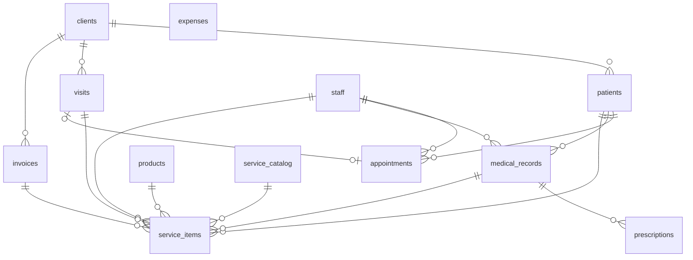

# 08 · Modelo de datos

Análisis pantalla por pantalla del client (`app.vetisuite.com`) y esquema
relacional propuesto para el server. Fuente: `client/src/modules/**`,
`client/src/states/app.state.tsx`, `client/src/lib/types.ts`.

Objetivo del esquema: **CRUD plano**. Una tabla por recurso que el usuario
crea/edita en pantalla. Nada de tablas de eventos, catálogos partidos ni
proyecciones — se añaden cuando el negocio las pida, no antes.

---

## 1. Inventario de pantallas

20 rutas. `s` = store zustand (`useVetStore`).

### Dashboard y Finanzas (solo lectura)

| Ruta | Lee | Deriva | Escribe |
|---|---|---|---|
| `/` | `appointments`, `patients`, `clients`, `vets`, `grooming`, `inventory`, `invoices` | citas no canceladas ordenadas por `time`; `stock <= minStock`; `daysUntil(expiry) <= 60`; `clients.debt > 0`; `Σ invoice.total` | — |
| `/finance` | `invoices`, `expenses`, `clients`, `services` | `Σ total`, `Σ iva`, `Σ expenses`, utilidad, margen; `byArea` = agrupación de `invoice.items[].source`; `byMethod`; `receivable = Σ client.debt + Σ service.price` | — |

Ambas son **agregaciones**, no entidades: en el server son queries/vistas, no tablas.

### Clientes y Pacientes

| Ruta | Lee | Relaciones que recorre | Escribe |
|---|---|---|---|
| `/clients` | `clients` (vía `api.ts` paginado), `patients`, `visits` | `client → patients` (conteo), `client → visit` (badge "visita abierta") | `openVisit(clientId, firstPetId)` |
| `/clients/new` | — | — | `addClient{name, phone, email}` |
| `/clients/show/:id` | `clients`, `patients`, `visits`, `services` | `client → patients`, `client → visit → services` (total $) | `openVisit`, `addPatient`, `updatePatient` |
| `/clients/edit/:id` | `clients` | — | `updateClient{name, phone, email}` |

Campos de formulario: cliente = `name*`, `phone*`, `email`. Paciente =
`name*`, `species` (select inline `Perro/Gato/Ave/Otro`), `breed`, `age`
(string libre: `"4 años"`), `allergies` (CSV → `string[]`), `aggressive`.
`sex` existe en el tipo y **no tiene UI en toda la app**.

`ClientSearch` (typeahead, usado por visits/grooming/appointments/billing) y
`PatientPicker` (mascotas del cliente) son los dos selectores compartidos:
todo flujo empieza por **cliente → mascota**.

### Citas

| Ruta | Lee | Deriva | Escribe |
|---|---|---|---|
| `/appointments` | `appointments`, `vets`, `patients` | matriz `HOURS × vets`; celda = `find(vetId && time && status != cancelada)` | — |
| `/appointments/new` | `patients`, `clients`, `vets` | presets de `?vetId&time&patientId` | `createAppointment` (valida choque vet+hora) |
| `/appointments/show/:id` | `appointments`, `patients`, `clients`, `vets`, `inventory` | `treatments[]` hardcodeado (consulta / baño / hemograma / vacuna) | `openVisit` + N×`addService` + `setAppointmentStatus("completada")` |
| `/appointments/edit/:id` | `appointments`, `vets` | — | `updateAppointment` (revalida choque) |

`Appointment` **no tiene fecha**, solo `time: "09:00"` de `HOURS`. Todo es
implícitamente "hoy". Estados: `pendiente → confirmada → completada`,
`cancelada` terminal. Sin `visitId`: al iniciar visita se pierde la trazabilidad.

### Visitas — el núcleo

| Ruta | Lee | Deriva | Escribe |
|---|---|---|---|
| `/visits` | `visits`, `clients`, `services` | por visita: `done/total`, `Σ price`, `ready = todos terminados` | — |
| `/visits/new` | `patients` | — | `openVisit` → redirige a edit |
| `/visits/edit/:id` | `visits`, `clients`, `patients`, `services`, `inventory` | catálogo por tipo: veterinaria=`CONSULT_FEE`, peluquería=`GROOM_SERVICES`, laboratorio=`LAB_TESTS`, medicamento=`inventory`, vacuna=`inventory[category="Vacunas"]` | `addService` (borrador), `removeService` (cascada), `startVisit` |
| `/visits/show/:id` | `visits`, `clients`, `services`, `patients` | stepper por servicio con `SERVICE_FLOWS[type].columns.indexOf(status)` | `advanceService` (solo veterinaria/medicamento/vacuna) |

Ciclo de vida:

```
openVisit(clientId) ─→ Visit{started:false}     (dedupe SOLO por clientId)
   addService ×N     ─→ ServiceItem{started:false, status: columns[0]}
   startVisit        ─→ started:true + materializa peluquería/laboratorio
                        en sus módulos con serviceId cruzado
   ...módulos mueven status...
   billVisit         ─→ Invoice + BORRA visit + BORRA services
```

### Clínica y Laboratorio

| Ruta | Lee | Escribe |
|---|---|---|
| `/clinic` | `patients`, `clients`, `records` | — |
| `/clinic/show/:patientId` | `records`, `vets`, `labOrders` | `loadLabResult` (vía `LabOrderCard`) |
| `/clinic/consultation/:patientId` | `patients`, `vets` | `createRecord{vitals, anamnesis, diagnosis}` — **no cobra** |
| `/clinic/apply-product/:patientId` | `records`, `inventory` | `applyProduct` → `stock -= qty` + `record.products.push` + `chargeToVisit(medicamento)` |
| `/clinic/lab-order/:patientId` | `patients` | `orderLab` → `ServiceItem` + `LabOrder` enlazados |
| `/clinic/prescription/:patientId` | `records` | `addPrescription` → `record.prescriptions.push` |

Rutas por `:patientId`, no por `:recordId`. La "consulta activa" es
`records.filter(patientId)[0]` — el orden depende de que `createRecord` haga
prepend. `vitals` son 3 strings libres (`"28.4 kg"`).

### Peluquería

| Ruta | Lee | Escribe |
|---|---|---|
| `/grooming` | `grooming`, `patients`, `clients` | `moveGrooming(id, proceso\|terminado\|entregado)` |
| `/grooming/new` | `patients` (vía picker) | `checkInGrooming` → `ServiceItem` + `GroomingJob` enlazados |
| `/grooming/show/:id` | `grooming`, `patients`, `clients` | `moveGrooming` |

Kanban de 3 columnas pero `GroomingStatus` tiene 4: `entregado` no tiene
columna, la tarjeta desaparece del tablero.

### Inventario

| Ruta | Lee | Deriva | Escribe |
|---|---|---|---|
| `/inventory` | `inventory` | `stock <= minStock`; `daysUntil(expiry) <= 60`; filtro por categoría | — |
| `/inventory/new` | — | — | `addProduct` (+ `stock` inicial) |
| `/inventory/show/:id` | `inventory` | mismas alertas | `restock` (modal) |
| `/inventory/edit/:id` | `inventory` | — | `updateProduct` (excluye `stock`) |

`restock(id, qty)` solo suma un número: sin lote, sin costo, sin proveedor,
sin actualizar `expiry`.

### Facturación

| Ruta | Lee | Deriva | Escribe |
|---|---|---|---|
| `/billing` | `visits`, `services`, `clients`, `invoices` | visitas cobrables (`done === total`) + historial | — |
| `/billing/collect/:id` (`:id` = **Visit**.id) | `visits`, `clients`, `services` | `subtotal → −discount → base → +IVA → +prevDebt → total`, todo con `round2` | `billVisit{discount$, ivaRate, method}` |
| `/billing/show/:id` (`:id` = **Invoice**.id) | `invoices`, `clients` | totales congelados | — |

---

## 2. Cómo se conectan hoy

```
Client ─1:N→ Patient
  │            ├─N→ Appointment (─→ Vet)
  │            ├─N→ MedicalRecord (─→ Vet, embebe products[] + prescriptions[])
  │            ├─N→ LabOrder ──┐
  │            └─N→ GroomingJob┤ (serviceId opcional)
  └─1:1→ Visit (abierta)       │
           └─1:N→ ServiceItem ←┘  ─→ Patient
                    │
                    └─ billVisit ─→ Invoice (items[] embebidos, sin FK)
                                    y la Visit + Services se BORRAN
```

Cinco problemas estructurales que el esquema debe resolver:

1. **`ServiceItem` / `GroomingJob` / `LabOrder` son la misma fila** partida en
   tres, sincronizada a mano con `serviceId` y mapeos de estado
   (`proceso → "en proceso"`). Doble fuente de verdad.
2. **Facturar destruye la historia**: `billVisit` borra visita y servicios, y
   copia `{desc, amount, source}` sin FK. Después no se puede responder qué
   mascota recibió qué.
3. **`Visit.patientId` es mentira**: `openVisit` deduplica solo por `clientId`
   e ignora el `patientId` recibido. La mascota real vive en cada servicio.
4. **`clients.debt` es un escalar mutable** que `billVisit` pone a `0`
   incondicionalmente. Nada del código lo incrementa nunca.
5. **`applyProduct` escribe dos veces el mismo hecho**: entrada en
   `record.products[]` + `ServiceItem` de tipo medicamento. Pueden divergir.

---

## 3. Esquema propuesto — 12 tablas



### 3.1 Tablas

| Tabla | Reemplaza a | Nota |
|---|---|---|
| `clients` | `Client` | ya existe |
| `patients` | `Patient` | ya existe |
| `staff` | `Vet` + groomers hardcodeados | `role: vet \| groomer \| recepcion` |
| `service_catalog` | `CONSULT_FEE`, `GROOM_SERVICES`, `LAB_TESTS` | lista de precios editable |
| `products` | `Product` | inventario |
| `appointments` | `Appointment` | con fecha real |
| `visits` | `Visit` | cabecera de atención |
| `service_items` | `ServiceItem` + `GroomingJob` + `LabOrder` + `AccountItem` + `AppliedProduct` | **la tabla central** |
| `medical_records` | `MedicalRecord` (vitals a columnas) | expediente |
| `prescriptions` | `Prescription` | documento legal, necesita id propio |
| `invoices` | `Invoice` (sin `items[]`) | totales congelados |
| `expenses` | `Expense` | caja |

### 3.2 Columnas

```
clients          id · name · phone · email · created_at · updated_at
                 (SIN debt → derivado, ver §3.4)

patients         id · client_id→clients · name · species · breed
                 · birth_date · sex · allergies text[] · aggressive
                 · created_at · updated_at

staff            id · name · role(enum) · color · active

service_catalog  id · type(service_type) · name · price numeric(10,2) · active
                 -- semilla: consulta $25, 5 servicios de estética, 6 exámenes

products         id · name · category(enum) · stock int · min_stock int
                 · price numeric(10,2) · cost numeric(10,2) · expiry date
                 · active

appointments     id · patient_id→patients · staff_id→staff
                 · starts_at timestamp (hora de pared, sin zona)
                 · timezone text (copia de organizations.timezone)
                 · duration_min int default 60
                 · reason · status(appointment_status) · created_at

visits           id · client_id→clients · appointment_id→appointments (null)
                 · invoice_id→invoices (null = ABIERTA) · started bool
                 · created_at · closed_at

service_items    id · visit_id→visits · patient_id→patients
                 · type(service_type) · label · unit_price numeric(10,2)
                 · qty int default 1 · status(service_status) · is_draft bool
                 -- origen (uno u otro, ambos opcionales):
                 · catalog_item_id→service_catalog · product_id→products
                 -- contexto:
                 · medical_record_id→medical_records (null)
                 · staff_id→staff (null)  -- veterinario o peluquero
                 -- campos por tipo (nullable):
                 · belongings text        -- peluquería
                 · result text            -- laboratorio
                 -- tiempos:
                 · created_at · started_at · finished_at · delivered_at
                 -- facturación:
                 · invoice_id→invoices (null = no facturado)

medical_records  id · patient_id→patients · staff_id→staff
                 · visit_id→visits (null) · date timestamptz
                 · weight_kg numeric(6,2) · temp_c numeric(4,1) · hr_bpm int
                 · anamnesis text · diagnosis text · closed_at

prescriptions    id · medical_record_id→medical_records · med · dosage
                 · issued_at

invoices         id · number · client_id→clients
                 · subtotal · discount · tax_rate numeric(4,4) · tax
                 · prev_debt · total · paid_amount   (todo numeric(10,2))
                 · method(pay_method) · issued_at · voided_at

expenses         id · category(enum) · description · amount numeric(10,2)
                 · date
```

Enums: `staff_role`, `service_type` (veterinaria/peluqueria/laboratorio/
medicamento/vacuna), `service_status` (pendiente/en_espera/en_consulta/
en_proceso/solicitado/resultado/aplicado/terminado/entregado),
`appointment_status`, `pay_method`, `product_category`, `expense_category`.

`SERVICE_FLOWS` (qué estados aplican a cada tipo y en qué orden) **se queda en
el código del client**: es flujo de UI, no dato.

### 3.3 Constraints e índices que hacen el trabajo

```sql
-- una sola visita abierta por cliente
CREATE UNIQUE INDEX visits_open_per_client
  ON visits (client_id) WHERE invoice_id IS NULL;

-- sin doble booking (hoy es un find() en el navegador)
CREATE UNIQUE INDEX appointments_slot
  ON appointments (staff_id, starts_at) WHERE status <> 'cancelada';

CREATE UNIQUE INDEX invoices_number ON invoices (number);

-- filtros reales de las pantallas
CREATE INDEX service_items_visit    ON service_items (visit_id);
CREATE INDEX service_items_board    ON service_items (type, status)
  WHERE invoice_id IS NULL;                 -- tableros de peluquería/lab
CREATE INDEX service_items_patient  ON service_items (patient_id);
CREATE INDEX medical_records_pat    ON medical_records (patient_id, date DESC);
CREATE INDEX appointments_agenda    ON appointments (starts_at, staff_id);
CREATE INDEX products_low_stock     ON products (stock) WHERE active;
```

### 3.4 Derivados — queries, no columnas

| Pantalla | Query |
|---|---|
| deuda del cliente | `Σ(invoices.total − invoices.paid_amount) WHERE client_id AND voided_at IS NULL` |
| visita lista para facturar | `NOT EXISTS(service_items WHERE visit_id AND status NOT IN (estados finales))` |
| última consulta | `medical_records WHERE patient_id ORDER BY date DESC LIMIT 1` |
| tablero de peluquería | `service_items WHERE type='peluqueria' AND invoice_id IS NULL` |
| órdenes de lab del paciente | `service_items WHERE type='laboratorio' AND patient_id=?` |
| productos aplicados en consulta | `service_items WHERE medical_record_id=?` |
| ingresos por área | `Σ(unit_price*qty) GROUP BY type WHERE invoice_id IS NOT NULL` |
| stock bajo / por caducar | `products WHERE stock <= min_stock` / `expiry < now()+60d` |

### 3.5 Fechas y zona horaria

La regla completa está en `AGENTS.md` (raíz), § Fechas y zona horaria. Columnas implementadas
(`packages/database/src/schemas/**`, migración `0001_ordinary_puma.sql`):

| Columna | Tipo | Estado |
|---|---|---|
| `organizations.timezone` | `text not null default 'UTC'` | nueva. Zona IANA de la clínica, única fuente de zona |
| `appointments.startsAt` | `timestamp` sin zona (`mode: 'string'`) | antes `timestamptz`. Hora de pared: `"2026-10-01T09:30:00"` |
| `appointments.timezone` | `text not null` | nueva. Copia inmutable de `organizations.timezone` al crear y al reprogramar |
| `appointments_availability.timezone` | — | eliminada. La zona se lee de `organizations` |

- Los demás `timestamptz` (incluidos `sessions.expiresAt`, `account_tokens.expiresAt`,
  `oauth_codes.expiresAt`, `users.bannedUntil`) siguen en UTC.
- Las columnas `date` (`patients.birthDate`, `patients_vaccination.nextDueAt`, `products.expiry`,
  `portals_field.minDate`/`maxDate`) no llevan `timezone`: su "hoy" se calcula en la zona de la organización.
- Cambiar `organizations.timezone` no toca las citas ya agendadas: conservan su `timezone`.

---

## 4. Qué se fusiona y por qué

**`service_items` absorbe cuatro tipos.** `GroomingJob`, `LabOrder`,
`AccountItem` y `AppliedProduct` son todos "una línea de trabajo con precio
sobre una mascota, dentro de una visita". Sus diferencias son 3 columnas
nullable (`belongings`, `result`, `product_id`). Partirlas en tablas obliga a
sincronizar estados a mano — que es exactamente el bug que tiene el client hoy.
Es una tabla ancha con columnas por tipo: se acepta a cambio de una sola fuente
de verdad.

**Facturar no borra nada.** `service_items.invoice_id` pasa de `NULL` a la
factura y `visits.invoice_id` cierra la visita. Los precios ya están congelados
en `unit_price`. Elimina la tabla `invoice_items` y arregla la trazabilidad.

**`visits` pierde `patient_id`.** La mascota vive en cada servicio. Una visita
de Carolina puede traer a Max y a Luna; hoy el modelo miente al respecto.

**`clients.debt` se deriva.** Un balance cacheado necesita mantenerse en cada
cobro, y hoy nadie lo incrementa. `invoices.paid_amount` es el único dato que
hay que escribir; la deuda sale de una suma.

**Un `service_catalog` en vez de tres constantes.** Precios editables sin
deploy. `products` sigue aparte porque tiene stock.

---

## 5. Lo que NO se modela (y cuándo añadirlo)

| Omitido | Añadir cuando |
|---|---|
| `stock_movements` / `product_batches` | haya que auditar mermas, aplicar FEFO o calcular COGS. Hoy `products.stock` es un `int` que suman `restock` y resta la aplicación de producto |
| tabla `payments` (pago mixto/parcial) | el negocio cobre en dos métodos o a plazos. Hoy: `method` + `paid_amount` en la factura |
| `appointment_status_history` / auditoría | haya que responder "quién canceló esto". Los `timestamptz` de `service_items` cubren la operación diaria |
| `users` / auth / multi-tenant (`clinic_id`) | haya más de una clínica o roles reales. Es un cambio transversal: hacerlo antes de tener clientes en producción |
| facturación electrónica SRI (RUC, clave de acceso, `001-001-000000001`) | se emita fiscalmente. Hoy `number` es un correlativo simple |
| horarios/ausencias de veterinarios (`HOURS` está hardcodeado) | la agenda deje de ser 08:00–17:00 fijo para todos |
| impuesto por línea (hoy `tax_rate` es global de la factura) | convivan tarifas 15% / 0% / exento |
| notas de crédito | `voided_at` en `invoices` no alcance |
| catálogos de especies / motivos de cita / alergias | dejen de ser texto libre útil |

---

## 6. Orden de implementación sugerido

`clients` y `patients` ya existen (`server/drizzle/clients/`, `server/drizzle/patients/`). El resto en el
orden en que se desbloquean las pantallas. Cada tabla va como pareja
`drizzle/<modulo>/<tablas>.table.js` + `.rls.js` (ver `server/drizzle/README.md`):

1. `staff` + `service_catalog` + `products` — catálogos, sin dependencias.
2. `visits` + `service_items` — desbloquea `/visits`, `/grooming`, la parte de
   laboratorio de `/clinic` y la worklist de `/billing`.
3. `appointments` — independiente, desbloquea `/appointments` y el dashboard.
4. `medical_records` + `prescriptions` — desbloquea el expediente.
5. `invoices` + `expenses` — cierra `/billing` y `/finance`.

Ajustes a lo ya migrado: `patients.age_months` → `birth_date` (la edad se
deriva) y añadir `sex`; quitar `clients.debt`.
